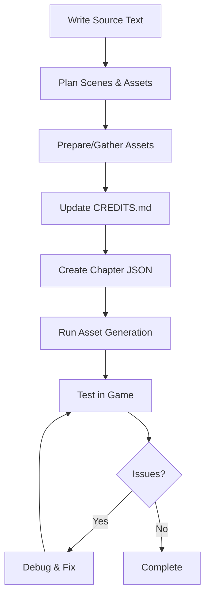

# Chapter Authoring Guide

A comprehensive guide for creating chapters 5-8 based on lessons learned from developing chapters 1-4.

## Table of Contents

1. [Workflow Overview](#workflow-overview)
2. [Writing the Source Text](#writing-the-source-text)
3. [Creating the JSON Chapter](#creating-the-json-chapter)
4. [Asset Preparation](#asset-preparation)
5. [Best Practices](#best-practices)
6. [Common Patterns](#common-patterns)
7. [Testing and Validation](#testing-and-validation)

> [!IMPORTANT] > **Source Materials Note**: Source text files and character profiles are stored outside this repository in the parent directory (`../source-materials/`). Only the compiled JSON chapter files are tracked in Git.

---

## Workflow Overview



**Estimated Time per Chapter**: 8-12 hours (based on ch1-4 experience)

---

## Writing the Source Text

### 1. Create Text File

Create `chapterN.txt` in `source-materials/chapters/text/`:

```
source-materials/chapters/text/chapter5.txt
```

### 2. Structure Guidelines

Based on chapters 1-4, maintain consistent structure:

- **Opening**: Set the scene, establish time/location
- **Development**: Character interactions, plot progression
- **Climax**: Key emotional or action moment
- **Transition**: Setup for next chapter

### 3. Character Voice

Reference character profiles in `source-materials/chapters/characters/`:

- **Haruka** (INFP, Type 4): Introspective, artistic, emotionally deep
- **Kurumi** (ENFJ, Type 2): Caring, supportive, people-oriented
- **K** (ENTJ, Type 8): Assertive, strategic, commanding
- **Ten** (ISFP, Type 9): Calm, perceptive, harmonious
- **Tomoya** (ESTP, Type 7): Energetic, spontaneous, action-oriented

---

## Creating the JSON Chapter

### 1. Scene Structure

Each chapter JSON follows this schema:

```json
{
  "scenes": [
    {
      "id": "unique_scene_id",
      "text": {
        "ja": "日本語のテキスト",
        "en": "English text"
      },
      "nextSceneId": "next_scene_id",

      // Optional fields
      "backgroundId": "bg_location_name",
      "bgm": "bgm_track_name",
      "se": "se_sound_name",
      "characters": {
        "left": "character_sprite_id",
        "center": {...},
        "right": "character_sprite_id"
      }
    }
  ]
}
```

**Note**: All chapters now use bilingual format `{ ja: "...", en: "..." }`. This is the standard format for text fields. Simple strings are still supported for backward compatibility but should be avoided in new chapters.

### 2. Scene ID Naming Convention

Based on ch1-4 patterns:

- Format: `chapter{N}_scene{X}` or `{chapter_name}_{scene_desc}`
- Examples:
  - `chapter1_scene1`, `chapter1_scene2`
  - `haruka_intro`, `train_departure`
- Be descriptive for complex scenes

### 3. Character Advanced Positioning

From ch1-4 experience, you can use advanced character configuration:

```json
"characters": {
  "center": {
    "image": "haruka_despair",
    "scale": 0.9,
    "opacity": 0.7,
    "filter": "grayscale(30%)",
    "xOffset": 0,
    "yOffset": 0
  },
  "left": "k_serious",
  "right": {
    "image": "ten_smile",
    "scale": 1.1
  }
}
```

**When to use:**

- `scale`: Emphasis (larger) or de-emphasis (smaller)
- `opacity`: Flashbacks, memories, background characters
- `filter`: Emotional states (grayscale for sadness, blur for confusion)
- `xOffset/yOffset`: Fine positioning adjustments

### 4. Audio Integration

**BGM Patterns from ch1-4:**

- Start BGM at chapter/scene beginning
- Change BGM for mood shifts
- Stop BGM (`"bgm": null`) for dramatic moments

**SE Patterns:**

- Use sparingly for impact
- Common: footsteps, environmental sounds, special abilities
- Don't overuse - silence is powerful

---

## Asset Preparation

### Images

#### Backgrounds

**Location**: `src/assets/images/backgrounds/`

**Naming**: `bg_{location}_{variant}.png`

- Examples: `bg_park_day.png`, `bg_club_room.png`

**Specifications:**

- Format: PNG
- Recommended size: 1920x1080 (will scale responsively)
- Aspect ratio: 16:9

**ch1-4 Pattern**: Approximately 2-3 unique backgrounds per chapter

#### Character Sprites

**Location**: `src/assets/images/characters/`

**Naming**: `{character}_{expression}.png`

- Examples: `haruka_neutral.png`, `k_serious.png`

**Specifications:**

- Format: PNG with transparency
- Recommended height: 800-1200px
- Character should be centered vertically

**ch1-4 Pattern**: 3-4 sprites per major character per chapter (including variations)

### Audio

#### Background Music (BGM)

**Location**: `src/assets/audio/bgm/`

**Specifications:**

- Format: MP3
- Bitrate: 128-192 kbps recommended
- Length: 2-5 minutes (will loop)

**IMPORTANT**: Update `CREDITS.md` immediately after adding!

#### Sound Effects (SE)

**Location**: `src/assets/audio/se/`

**Specifications:**

- Format: MP3
- Bitrate: 96-128 kbps (smaller files better)
- Length: 0.5-5 seconds typically

**ch1-4 Patterns:**

- Environmental: wind, water, footsteps
- Action: hits, impacts
- Special: character abilities (e.g., Ten's ball, K's power)

**IMPORTANT**: Update `CREDITS.md` immediately after adding!

---

## Best Practices

### From Chapters 1-4 Experience

1. **Start Simple**

   - First draft: basic scenes with simple character positioning
   - Second pass: Add BGM
   - Third pass: Add SE and advanced effects
   - Fourth pass: Polish and playtest

2. **Asset Naming is Critical**

   - Use descriptive, lowercase names
   - Underscores for separation
   - Avoid special characters
   - Run `npm run generate-assets` after adding new assets

3. **Scene Transitions**

   - Keep scenes focused (1-3 dialogue exchanges)
   - Use background changes sparingly
   - BGM changes signal major shifts

4. **Character Presence**

   - Don't crowd scenes (max 3 characters visible)
   - Use `null` to remove characters: `"center": null`
   - Center position = primary speaker (typically)

5. **Text Length**

   - Optimal: 1-2 sentences per scene
   - Maximum: ~100 characters Japanese, ~200 English
   - Break long monologues into multiple scenes

6. **Testing Frequency**
   - Test after every 10-15 scenes
   - Don't wait until chapter completion
   - Use `npm run dev` for quick testing

---

## Common Patterns

### Pattern: Character Introduction

```json
{
  "id": "intro_character",
  "text": "Character appears...",
  "backgroundId": "bg_location",
  "characters": {
    "center": "character_neutral"
  },
  "se": "character_theme_se",
  "nextSceneId": "next"
}
```

### Pattern: Emotional Shift

```json
{
  "id": "emotional_shift",
  "text": "Something happens...",
  "characters": {
    "center": {
      "image": "character_sad",
      "opacity": 0.8
    }
  },
  "bgm": "sad_theme",
  "nextSceneId": "next"
}
```

### Pattern: Scene Transition

```json
{
  "id": "location_change",
  "text": "Moving to new location...",
  "backgroundId": "bg_new_location",
  "characters": null,
  "bgm": null,
  "nextSceneId": "next"
}
```

### Pattern: Multi-Character Dialogue

```json
{
  "id": "group_scene_1",
  "text": "Left character speaks...",
  "characters": {
    "left": "char1_talking",
    "center": "char2_neutral",
    "right": "char3_neutral"
  },
  "nextSceneId": "group_scene_2"
},
{
  "id": "group_scene_2",
  "text": "Center character responds...",
  "characters": {
    "left": "char1_neutral",
    "center": "char2_talking",
    "right": "char3_neutral"
  },
  "nextSceneId": "next"
}
```

---

## Testing and Validation

### Before Committing

1. **Asset Generation**

   ```bash
   npm run generate-assets
   ```

   - Verifies all assets exist
   - Generates TypeScript types

2. **Build Test**

   ```bash
   npm run build
   ```

   - Catches TypeScript errors
   - Validates JSON structure

3. **Runtime Test**
   ```bash
   npm run dev
   ```
   - Play through entire chapter
   - Check all scenes flow correctly
   - Verify audio plays correctly
   - Check character positioning

### Checklist

- [ ] All assets referenced in JSON exist in file system
- [ ] All new assets listed in CREDITS.md with attribution
- [ ] Chapter plays from start to finish without errors
- [ ] BGM loops smoothly
- [ ] SE plays at appropriate moments
- [ ] Character sprites display correctly
- [ ] Text is readable and properly sized
- [ ] No TypeScript compilation errors
- [ ] Scene transitions are smooth

---

## Quick Reference

### File Locations

| Type         | Location (relative to repo root)     | Notes                            |
| ------------ | ------------------------------------ | -------------------------------- |
| Source Text  | `../source-materials/chapters/text/` | Outside repository (not tracked) |
| Chapter JSON | `src/data/chapters/chapterN.json`    | Tracked in Git                   |
| Backgrounds  | `src/assets/images/backgrounds/`     | Tracked in Git                   |
| Characters   | `src/assets/images/characters/`      | Tracked in Git                   |
| BGM          | `src/assets/audio/bgm/`              | Tracked in Git                   |
| SE           | `src/assets/audio/se/`               | Tracked in Git                   |

### Commands

| Command                   | Purpose                         |
| ------------------------- | ------------------------------- |
| `npm run dev`             | Start development server        |
| `npm run build`           | Build for production            |
| `npm run generate-assets` | Generate asset type definitions |
| `npm run lint`            | Check code quality              |

### Support Files

- Character Profiles: `../source-materials/chapters/characters/` (outside repo)
- Asset Credits: `CREDITS.md`
- Architecture Docs: `docs/ARCHITECTURE.md`
- Asset Guidelines: `docs/ASSET_GUIDELINES.md`
