# Project Equity - Project Guide

> A comprehensive guide for visitors and developers to understand the project structure, architecture, and development workflow.

---

## 🎮 Project Overview

**Project Equity** is a browser-based sound novel (visual novel) game engine built with modern web technologies.

```mermaid
flowchart LR
    subgraph "Tech Stack"
        A[React 19] --> B[TypeScript]
        B --> C[Vite]
        C --> D[Browser]
    end
    subgraph "Game Features"
        E[📖 Multi-chapter Story]
        F[🎨 Character Sprites]
        G[🎵 BGM & Sound Effects]
        H[💾 Save/Load System]
    end
```



### Key Features

- 📖 Multi-chapter storytelling with branching paths
- 🎨 Dynamic character rendering with expressions
- 🎵 Background music and sound effects integration
- 💾 Local save/load system with multiple slots
- 🌐 Full bilingual support (Japanese/English) - All chapters 1-5
- ⚙️ Configurable text speed and volume

---

## 📁 Project Structure Overview

```
sound-novel-game/
├── 📄 Configuration Files
├── 📚 Documentation
├── 🔧 Scripts
└── src/
    ├── 🎨 assets/          # Images, audio, fonts
    ├── 🧩 components/      # React UI components
    ├── 🔄 context/         # React context providers
    ├── 📊 data/            # Chapter JSON data
    ├── ⚙️ engine/          # Core game logic
    ├── 🪝 hooks/           # Custom React hooks
    ├── 📝 types/           # TypeScript definitions
    └── 🛠️ utils/           # Utility functions
```

---

## 📂 Root Directory Files

### Configuration Files

| File                                                                                       | Role                                       | When to Modify                          |
| ------------------------------------------------------------------------------------------ | ------------------------------------------ | --------------------------------------- |
| [`package.json`](file:///e:/downloads_E/me_1125/sound-novel-game/package.json)             | Dependencies, scripts, project metadata    | Adding packages, changing build scripts |
| [`package-lock.json`](file:///e:/downloads_E/me_1125/sound-novel-game/package-lock.json)   | Locked dependency versions                 | Auto-updated by npm                     |
| [`vite.config.ts`](file:///e:/downloads_E/me_1125/sound-novel-game/vite.config.ts)         | Build configuration, plugins, optimization | Changing build behavior                 |
| [`tsconfig.json`](file:///e:/downloads_E/me_1125/sound-novel-game/tsconfig.json)           | TypeScript base configuration              | Rarely                                  |
| [`tsconfig.app.json`](file:///e:/downloads_E/me_1125/sound-novel-game/tsconfig.app.json)   | App-specific TypeScript settings           | Rarely                                  |
| [`tsconfig.node.json`](file:///e:/downloads_E/me_1125/sound-novel-game/tsconfig.node.json) | Node scripts TypeScript settings           | Rarely                                  |
| [`eslint.config.js`](file:///e:/downloads_E/me_1125/sound-novel-game/eslint.config.js)     | Code linting rules                         | Adding/modifying lint rules             |
| [`.gitignore`](file:///e:/downloads_E/me_1125/sound-novel-game/.gitignore)                 | Git file exclusions                        | Adding files to ignore                  |

### Entry Points

| File                                                                           | Role                                  |
| ------------------------------------------------------------------------------ | ------------------------------------- |
| [`index.html`](file:///e:/downloads_E/me_1125/sound-novel-game/index.html)     | HTML entry point, loads the React app |
| [`netlify.toml`](file:///e:/downloads_E/me_1125/sound-novel-game/netlify.toml) | Netlify deployment configuration      |

### Documentation

| File                                                                                 | Purpose                       | Primary Audience |
| ------------------------------------------------------------------------------------ | ----------------------------- | ---------------- |
| [`README.md`](file:///e:/downloads_E/me_1125/sound-novel-game/README.md)             | Project overview, quick start | All visitors     |
| [`CONTRIBUTING.md`](file:///e:/downloads_E/me_1125/sound-novel-game/CONTRIBUTING.md) | How to contribute             | Contributors     |
| [`CREDITS.md`](file:///e:/downloads_E/me_1125/sound-novel-game/CREDITS.md)           | Asset attribution             | Legal compliance |
| [`LICENSE.md`](file:///e:/downloads_E/me_1125/sound-novel-game/LICENSE.md)           | Project license               | Legal            |
| [`DEPLOY.md`](file:///e:/downloads_E/me_1125/sound-novel-game/DEPLOY.md)             | Deployment instructions       | Deployers        |
| [`CHANGELOG.md`](file:///e:/downloads_E/me_1125/sound-novel-game/CHANGELOG.md)       | Version history               | All              |

---

## 🗂️ Source Code Structure (`src/`)

### Directory Map


---

### Core Files

| File                                                                         | Role           | Description                              |
| ---------------------------------------------------------------------------- | -------------- | ---------------------------------------- |
| [`main.tsx`](file:///e:/downloads_E/me_1125/sound-novel-game/src/main.tsx)   | App Bootstrap  | React app entry point, mounts to DOM     |
| [`App.tsx`](file:///e:/downloads_E/me_1125/sound-novel-game/src/App.tsx)     | Main Component | Game shell, routing, state orchestration |
| [`App.css`](file:///e:/downloads_E/me_1125/sound-novel-game/src/App.css)     | App Styles     | Main application styling                 |
| [`index.css`](file:///e:/downloads_E/me_1125/sound-novel-game/src/index.css) | Global Styles  | CSS reset and global variables           |

---

### 🎨 Assets (`src/assets/`)

**Purpose:** Store all media files used in the game.

```
assets/
├── audio/
│   ├── bgm/          # Background music (MP3)
│   └── se/           # Sound effects (MP3)
├── images/
│   ├── backgrounds/  # Scene backgrounds (PNG)
│   ├── characters/   # Character sprites (PNG)
│   ├── ui/           # UI elements & icons (PNG)
│   └── generated/    # AI-generated images
└── fonts/            # Custom fonts
```

| Subfolder             | Content Type      | Format | Guidelines                     |
| --------------------- | ----------------- | ------ | ------------------------------ |
| `audio/bgm/`          | Background music  | MP3    | 128-192kbps, loopable          |
| `audio/se/`           | Sound effects     | MP3    | 96-128kbps, short              |
| `images/backgrounds/` | Scene backdrops   | PNG    | 1920x1080, 16:9                |
| `images/characters/`  | Character sprites | PNG    | Transparent, 800-1200px height |
| `images/ui/`          | Interface icons   | PNG    | Transparent, 128-256px         |

---

### 🧩 Components (`src/components/`)

**Purpose:** React UI components that render the game interface.


| Component        | File                                                                                                        | Role                                           |
| ---------------- | ----------------------------------------------------------------------------------------------------------- | ---------------------------------------------- |
| Background Layer | [`BackgroundLayer.tsx`](file:///e:/downloads_E/me_1125/sound-novel-game/src/components/BackgroundLayer.tsx) | Renders scene backgrounds with transitions     |
| Character Layer  | [`CharacterLayer.tsx`](file:///e:/downloads_E/me_1125/sound-novel-game/src/components/CharacterLayer.tsx)   | Displays character sprites (left/center/right) |
| Text Box         | [`TextBox.tsx`](file:///e:/downloads_E/me_1125/sound-novel-game/src/components/TextBox.tsx)                 | Shows character names and dialogue             |
| Typewriter       | [`TypewriterText.tsx`](file:///e:/downloads_E/me_1125/sound-novel-game/src/components/TypewriterText.tsx)   | Animates text character by character           |
| Choice List      | [`ChoiceList.tsx`](file:///e:/downloads_E/me_1125/sound-novel-game/src/components/ChoiceList.tsx)           | Renders player decision options                |
| Save/Load UI     | [`SaveLoadUI.tsx`](file:///e:/downloads_E/me_1125/sound-novel-game/src/components/SaveLoadUI.tsx)           | Manage save slots                              |
| Config UI        | [`ConfigUI.tsx`](file:///e:/downloads_E/me_1125/sound-novel-game/src/components/ConfigUI.tsx)               | Game settings (volume, text speed)             |
| Backlog UI       | [`BacklogUI.tsx`](file:///e:/downloads_E/me_1125/sound-novel-game/src/components/BacklogUI.tsx)             | Text history viewer                            |
| Error Boundary   | [`ErrorBoundary.tsx`](file:///e:/downloads_E/me_1125/sound-novel-game/src/components/ErrorBoundary.tsx)     | Catches and displays errors gracefully         |

---

### ⚙️ Engine (`src/engine/`)

**Purpose:** Core game logic, independent of React UI.


| File                                                                                          | Role             | Key Functions                        |
| --------------------------------------------------------------------------------------------- | ---------------- | ------------------------------------ |
| [`storyEngine.ts`](file:///e:/downloads_E/me_1125/sound-novel-game/src/engine/storyEngine.ts) | Scene Navigation | Find scenes, resolve next scene      |
| [`types.ts`](file:///e:/downloads_E/me_1125/sound-novel-game/src/engine/types.ts)             | Type Definitions | Scene, Chapter, GameState interfaces |
| [`validator.ts`](file:///e:/downloads_E/me_1125/sound-novel-game/src/engine/validator.ts)     | Data Validation  | Validates chapter JSON with Zod      |
| [`saveLoad.ts`](file:///e:/downloads_E/me_1125/sound-novel-game/src/engine/saveLoad.ts)       | Persistence      | Save/load game state to localStorage |
| [`errors.ts`](file:///e:/downloads_E/me_1125/sound-novel-game/src/engine/errors.ts)           | Error Types      | Custom error classes                 |

---

### 🔄 Context (`src/context/`)

**Purpose:** React context providers for global state management.

| File                                                                                             | Role                                              |
| ------------------------------------------------------------------------------------------------ | ------------------------------------------------- |
| [`GameContext.tsx`](file:///e:/downloads_E/me_1125/sound-novel-game/src/context/GameContext.tsx) | Provides game state and actions to all components |

---

### 📊 Data (`src/data/`)

**Purpose:** Game content stored as JSON files.

```
data/
├── chapters/
│   ├── chapter1.json    # Chapter 1 scenes (bilingual)
│   ├── chapter2.json    # Chapter 2 scenes (bilingual)
│   ├── chapter3.json    # Chapter 3 scenes (bilingual)
│   ├── chapter4.json    # Chapter 4 scenes (bilingual)
│   └── chapter5.json    # Chapter 5 scenes (bilingual)
└── schema/              # JSON schema definitions
```

| Content  | Location                 | Format                                                                                                            |
| -------- | ------------------------ | ----------------------------------------------------------------------------------------------------------------- |
| Chapters | `chapters/chapterN.json` | See [CHAPTER_AUTHORING_GUIDE.md](file:///e:/downloads_E/me_1125/sound-novel-game/docs/CHAPTER_AUTHORING_GUIDE.md) |

---

### 🪝 Hooks (`src/hooks/`)

**Purpose:** Custom React hooks for reusable logic.

| File                                                                                           | Role                               |
| ---------------------------------------------------------------------------------------------- | ---------------------------------- |
| [`useAudio.ts`](file:///e:/downloads_E/me_1125/sound-novel-game/src/hooks/useAudio.ts)         | Audio playback management (BGM/SE) |
| [`useGameState.ts`](file:///e:/downloads_E/me_1125/sound-novel-game/src/hooks/useGameState.ts) | Game state hook                    |

---

### 📝 Types (`src/types/`)

**Purpose:** TypeScript type definitions.

| File                                                                               | Role                                  |
| ---------------------------------------------------------------------------------- | ------------------------------------- |
| [`assets.ts`](file:///e:/downloads_E/me_1125/sound-novel-game/src/types/assets.ts) | Auto-generated asset type definitions |

> ⚠️ **Note:** `assets.ts` is auto-generated by `npm run generate-assets`. Do not edit manually.

---

### 🛠️ Utils (`src/utils/`)

**Purpose:** Utility functions.

| File      | Role                                     |
| --------- | ---------------------------------------- |
| Utilities | Helper functions used across the project |

---

## 🔧 Scripts (`scripts/`)

**Purpose:** Build and validation automation scripts.

| Script                                                                                                       | Command                   | Role                                            |
| ------------------------------------------------------------------------------------------------------------ | ------------------------- | ----------------------------------------------- |
| [`generate-asset-types.ts`](file:///e:/downloads_E/me_1125/sound-novel-game/scripts/generate-asset-types.ts) | `npm run generate-assets` | Scans assets folder, generates TypeScript types |
| [`validate-assets.js`](file:///e:/downloads_E/me_1125/sound-novel-game/scripts/validate-assets.js)           | `npm run validate-assets` | Validates asset references in chapter JSON      |

---

## 📚 Documentation (`docs/`)

| Document                                                                                                        | Purpose                                 |
| --------------------------------------------------------------------------------------------------------------- | --------------------------------------- |
| [`CHAPTER_AUTHORING_GUIDE.md`](file:///e:/downloads_E/me_1125/sound-novel-game/docs/CHAPTER_AUTHORING_GUIDE.md) | Complete guide for writing new chapters |
| [`ASSET_GUIDELINES.md`](file:///e:/downloads_E/me_1125/sound-novel-game/docs/ASSET_GUIDELINES.md)               | Specifications for images and audio     |

---

## 🔄 Development Workflow

### Adding a New Chapter


### Deployment Flow


---

## 🧭 Quick Reference

### Key Commands

```bash
npm run dev          # Start development server
npm run build        # Build for production
npm run preview      # Preview production build
npm run generate-assets  # Update asset types
npm run lint         # Check code quality
```

### Common Tasks

| Task                 | Files to Modify                                              |
| -------------------- | ------------------------------------------------------------ |
| Add new chapter      | `src/data/chapters/`, `src/App.tsx`                          |
| Add character sprite | `src/assets/images/characters/`, run `generate-assets`       |
| Add background       | `src/assets/images/backgrounds/`, run `generate-assets`      |
| Add BGM              | `src/assets/audio/bgm/`, `CREDITS.md`, run `generate-assets` |
| Add sound effect     | `src/assets/audio/se/`, `CREDITS.md`, run `generate-assets`  |
| Modify UI            | `src/components/`                                            |
| Change game logic    | `src/engine/`                                                |
| Update settings      | `src/context/`, `src/components/ConfigUI.tsx`                |

---

## 📋 File-Role Quick Lookup

```
📁 Root Configuration
├── package.json         → Dependencies & scripts
├── vite.config.ts       → Build configuration
├── netlify.toml         → Deployment settings
└── index.html           → HTML entry point

📁 Source Code
├── main.tsx             → App bootstrap
├── App.tsx              → Main game component
├── components/          → UI components
├── context/             → State management
├── data/chapters/       → Story content
├── engine/              → Game logic
├── hooks/               → Custom React hooks
├── assets/              → Media files
└── types/               → TypeScript definitions

📁 Documentation
├── README.md            → Project overview
├── CONTRIBUTING.md      → Contribution guide
├── docs/                → Development guides
└── CREDITS.md           → Asset attribution
```

---

> **Need more details?** See:
>
> - [README.md](file:///e:/downloads_E/me_1125/sound-novel-game/README.md) - Quick start
> - [CONTRIBUTING.md](file:///e:/downloads_E/me_1125/sound-novel-game/CONTRIBUTING.md) - Contribution workflow
> - [docs/CHAPTER_AUTHORING_GUIDE.md](file:///e:/downloads_E/me_1125/sound-novel-game/docs/CHAPTER_AUTHORING_GUIDE.md) - Writing chapters
> - [docs/ASSET_GUIDELINES.md](file:///e:/downloads_E/me_1125/sound-novel-game/docs/ASSET_GUIDELINES.md) - Asset specs
